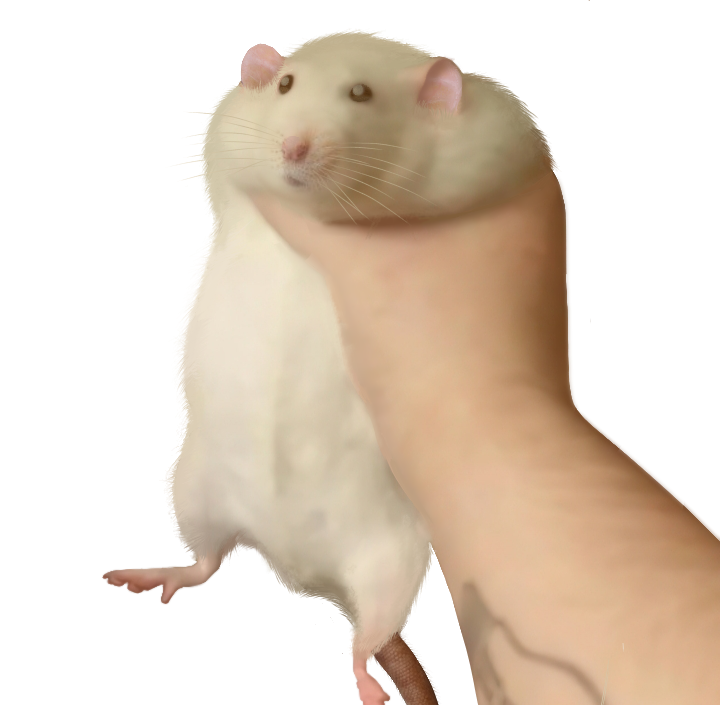

## Discord-RAT has been rewritten! Check it out and give it a star! ⭐

  

<h1 align="center">Discord-RAT: Remote Administration Tool</h1>
  

  
  
  
  
  
  

  

Discord-RAT is a cross-platform RAT that uses Discord as an interactive C2 Server.
     
    <a href="https://github.com/codeuk/discord-rat/issues">Report Bug</a>
    ·
    <a href="https://github.com/codeuk/discord-rat/issues">Request Feature</a>
    ·
    <a href="https://github.com/codeuk/discord-rat#commands">Features</a>
    ·
    <a href="https://github.com/codeuk/discord-rat#screenshots">Screenshots</a>
  

## About Discord-RAT
Discord-RAT can handle many clients concurrently, along with archiving, Windows and Linux compatibility (cross-platform), upload/downloading, reverse shell functionality, and much, much [more](https://github.com/codeuk/discord-rat#screenshots)! *(The built agent is small in size, approx. 2mb)*

This tool has been recently rewritten in [GoLang](https://go.dev), please star ⭐ it to show your support!

## How-To
- [Install](https://github.com/codeuk/discord-rat#installation) Discord-RAT and GoLang on your machine.
- [Configure](https://github.com/codeuk/discord-rat#configuration) the Discord-RAT installation.
- [Compile](https://github.com/codeuk/discord-rat/edit/main/README.md#compiling-discord-rat-agents) Discord-RAT agents on your system.
- [Use](https://github.com/codeuk/discord-rat/edit/main/README.md#interacting-with-the-bot) the running Discord-RAT Bot appropriately.

## Installation

### Discord Bot and Server
As a prerequisite, you will need to have created a Discord **Bot** and a Discord **Server** that you have invited the bot to.

If you're not sure how to do the above, have a look at these resources:
- [How to make a Discord Bot (IONOS)](https://www.ionos.com/digitalguide/server/know-how/creating-discord-bot/)
- [How to set up a Discord Server (IONOS) ](https://ionos.com/digitalguide/server/know-how/how-to-set-up-a-discord-server/)
- [How to Invite Your Discord Bot to Your Server (YouTube)](https://www.youtube.com/watch?v=ypSSUTuh6SQ)

⚠️ **Make sure that you give the Discord Bot the following permissions on the "Bot Permissions" screen:**
- Send Messages
- Read Messages
- Attach Files
- Manage Server

Or, you can just give it Administrator permissions.

### GoLang
As this project was creating using [GoLang](https://go.dev), you will need to have it installed.

After you've installed GoLang (and checked that it is working!), continue with these steps:

- Download/Clone this GitHub repository to a local folder on your Windows/Linux machine.
    - `git clone https://github.com/codeuk/discord-rat`
    - Or simply press the **Code** > **Download ZIP** button and extract the files somewhere. 
- Change your directory to / go into the folder containing the repositories files.
- Follow the steps in [Usage](https://github.com/codeuk/discord-rat#usage)

## Usage

### Configuration
To use Discord-RAT, you will need to configure it to host *your* Discord Bot in *your* Discord Server.

You can do this by editing the configuration file (`pkg/util/config.go`) as follows:
- Replace `BotToken` with your Discord Bot's Token (you should have it copied from [earlier](https://github.com/codeuk/discord-rat/edit/main/README.md#discord-bot-and-server)).
- Replace `ServerID` with the ID of the Discord Server that your Discord Bot is in (read below for guide)
- Optionally, turn `DeleteOnExit` to true if you want each channel to be deleted when the agent exits, otherwise they will saved.

  
How can I obtain my Discord Server's ID? ⚙️

 
In order to obtain a server ID on Discord you need to enable Developer Mode:

- Go to "User Settings"
- Under "App Settings" to go the "Advanced" tab
- Press "Enable Developer Mode"
- You may or may not need to restart your Discord client, but usually it’s applied automatically

- Now that you have Developer Mode enabled, right click on the desired server icon you wish to obtain the ID of
- Select Copy ID in the menu shown to copy it to your clipboard

  
You can now paste the Server ID in the `pkg/util/config.go` file!

### Compiling Discord-RAT Agents
To compile Discord-RAT binaries (executables/stubs) on both **Windows** and **Linux**, use this guide:

- Simply navigate to the folder you have installed Discord-RAT in.
- If on **Windows**, launch the `compile.bat` script in the Discord-RAT directory.

- If on **Linux**, run the command `make Makefile all` in the Discord-RAT directory.

- Allow the script to run and let the builds compile and compress.
- All agent builds will be stored in the `/bin` directory (along with **UPX**, which is what they are compressed with).

### Interacting with the Bot
Now that you have successfully configured and compiled a Discord-RAT agent, you can wait for the file to be opened (by you or a third-party) and start interacting with the bot through the built-in commands.

Once opened, the Bot will create a channel with a channel name derived from the host (the machine running the Discord-RAT program) computer's external IP address (ex. 1851371261278) and will send a `New Agent Connected` embed along with the `Command Menu` embed, which lists all default commands you can use.

- Always make sure to use the correct commands based on the operating system the agent is using (`dir` for displaying Windows files, and `ls` for Linux, etc.).
- Make sure to read the [commands](https://github.com/codeuk/discord-rat#commands) section before executing anything so you know what you're doing.

*When the agent exits or shuts down, the channel will be archived (#channel -> #archive-channel) if `DeleteOnExit` is set to false.*

## Showcase
> **Note**
> The showcase video hasn't been created yet... It will be here soon!

## Screenshots

## Commands
When all commands have been fully developed, I'll leave full documentation and guides for each command that Discord-RAT allows you to use; but at the moment, only the commands listed in the **Command Menu** have been developed, and are still to be improved in future updates.

## Disclaimer
Discord-RAT is intended for legal and ethical use only. The developers and contributors of Discord-RAT are not responsible for any illegal or unethical activities performed using this tool. Users of Discord-RAT are solely responsible for their actions and are advised to use the tool for legitimate security testing purposes only. Reselling this program as a closed-source binary could have legal consequences, please do not steal the source.

# License
Discord-RAT is licensed under the GNU General Public License v3.0. See the LICENSE file for more information.
